# Covid-19 Prevention Online Guidance During International Conference 

Techinal Communication Project  
by Group 3 Class 24,  
Graduate English,  
Southeast University

## Template: [Material Dashboard React](https://demos.creative-tim.com/nextjs-material-dashboard/dashboard) & [NextJS Material Kit](https://demos.creative-tim.com/nextjs-material-kit?ref=njsmk-readme)

     

| NextJS Material Dashboard | NextJS Material kit |
| --- | --- |
|  | |

NextJS Material Dashboard is a free Material-UI, NextJS and React Admin with a fresh, new design inspired by Google's Material Design. We are very excited to introduce our take on the material concepts through an easy to use and beautiful set of components. NextJS Material Dashboard was built over the popular Material-UI, NextJS and React frameworks.

NextJS Material Dashboard makes use of light, surface and movement. The general layout resembles sheets of paper following multiple different layers, so that the depth and order is obvious. The navigation stays mainly on the left sidebar and the content is on the right inside the main panel.

NextJS Material Dashboard comes with 5 color filter choices for both the sidebar and the card headers (blue, green, orange, red and purple) and an option to have a background image on the sidebar.

NextJS Material Dashboard was created using [NextJS](https://nextjs.org/?ref=creativetim) and it uses a framework built by our friend [Olivier - Material-UI](https://github.com/mui-org/material-ui?ref=creativetim), who did an amazing job creating the backbone for the material effects, animations, ripples and transitions. Big thanks to his team for the effort and forward thinking they put into it.

We are very excited to share this dashboard with you and we look forward to hearing your feedback!

It is open source, and it's Github Repo can be found [here](https://github.com/creativetimofficial/nextjs-material-dashboard).

### Licensing

- Copyright 2021 Creative Tim (https://www.creative-tim.com)
- Licensed under MIT (https://github.com/creativetimofficial/nextjs-material-dashboard/blob/master/LICENSE.md)

## Pages & Routing

### Homepage
The navigation provides direct links to other pages.(background is for testing, should be a proper video)
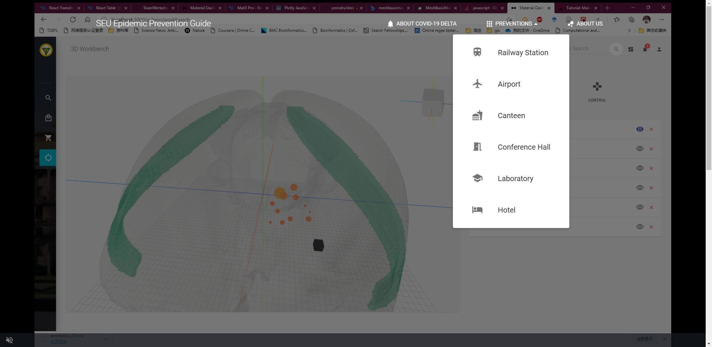
And scroll down...
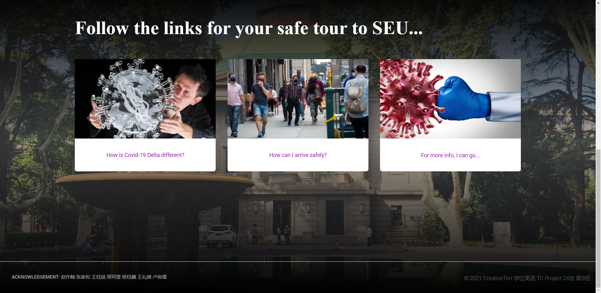
are also the links to the pages.

### Basic info about covid-19
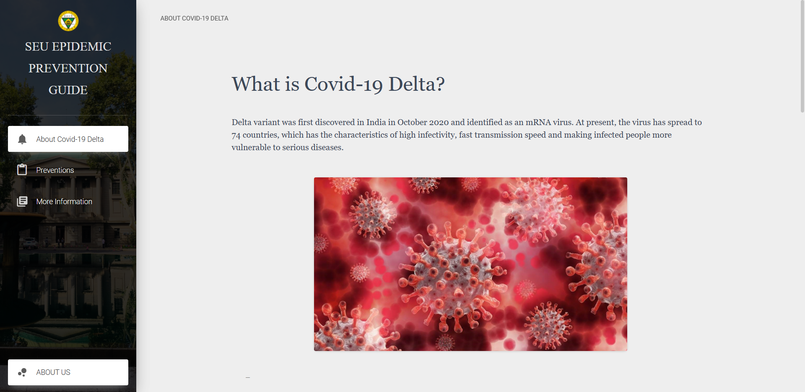
Basic introduction to the virus.

### Preventions
The first page of preventions give general directions for prevention.
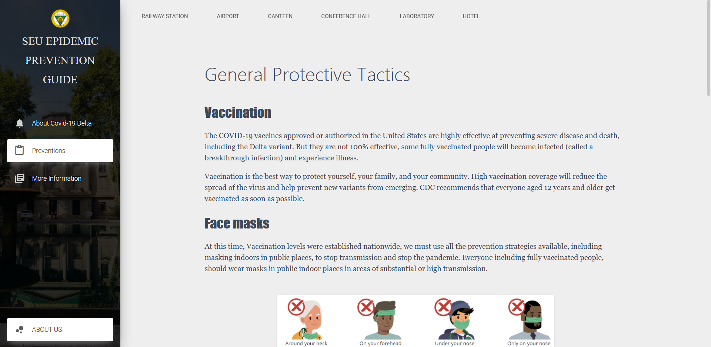
On the horizontal navigation bar, you can go to some specific place and check for specific actions.

#### Example: Railway Station
In a uniform manner, we provide instructions on risks and preventions separately.
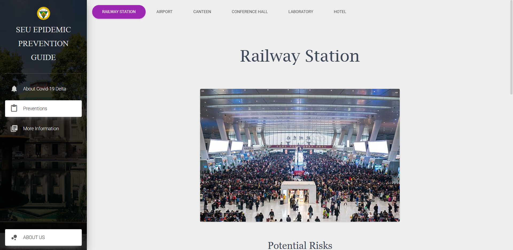
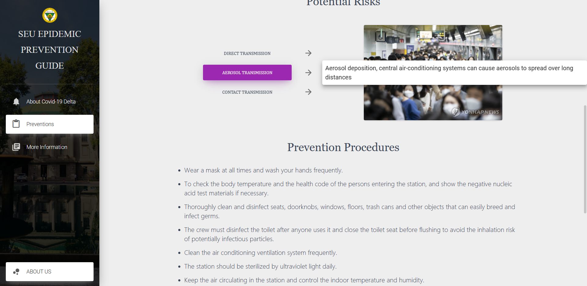
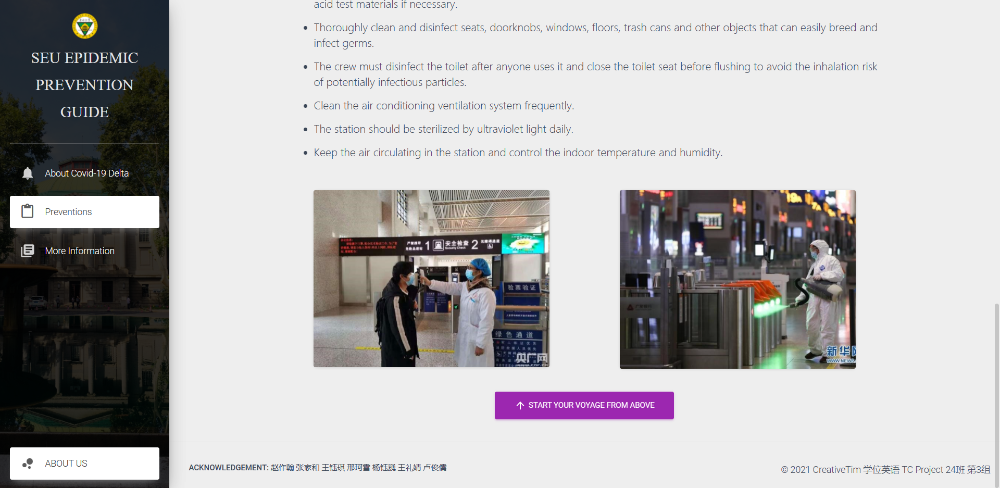

### More info
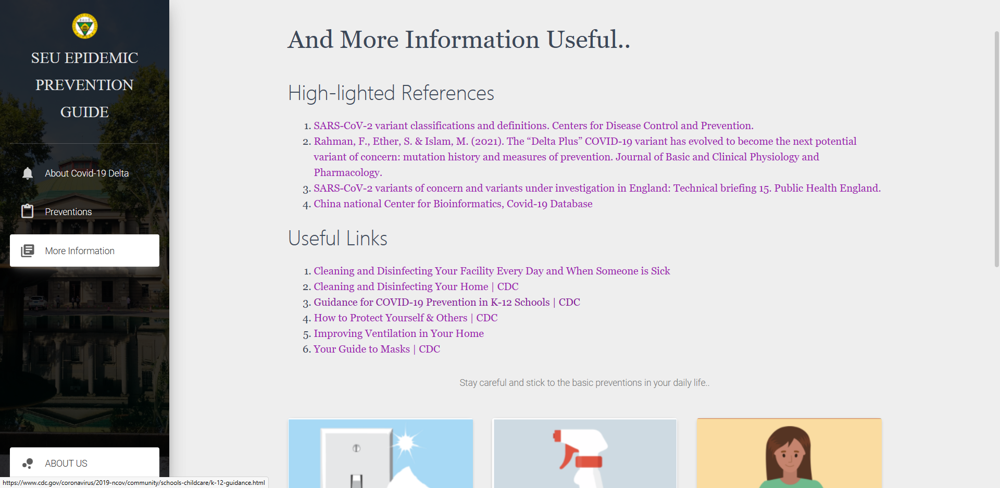
Prudent references are often necessary for info transfer.

### About us
About Nanjing, about SEU, about the team.
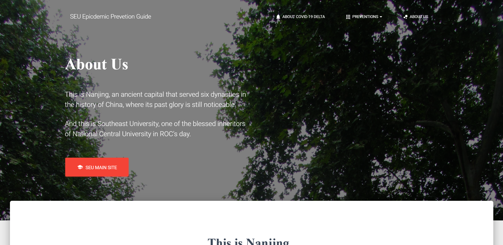
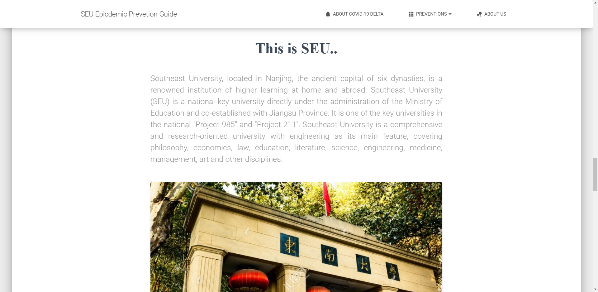
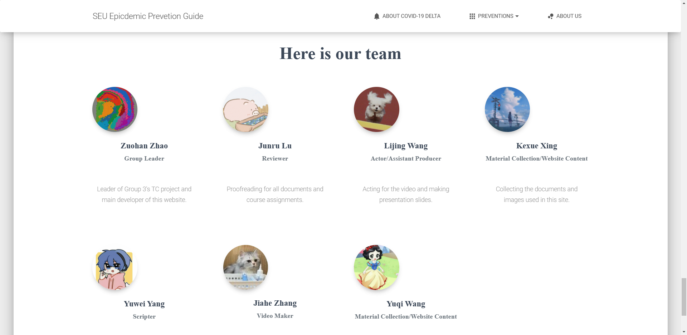

Traveller, have fun and make haste before you leave!

## Acknowledgement
(sorted by time joining chatroom)  
* Zuohan Zhao(leader)  
* Junru Lu  
* Lijing Wang  
* Kexue Xing  
* Yuwei Yang  
* Jiahe Zhang  
* Yuqi Wang  